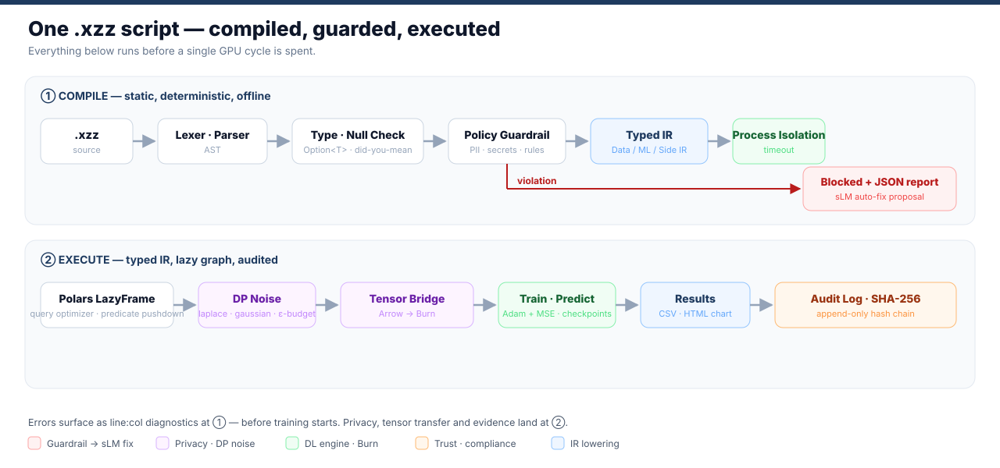
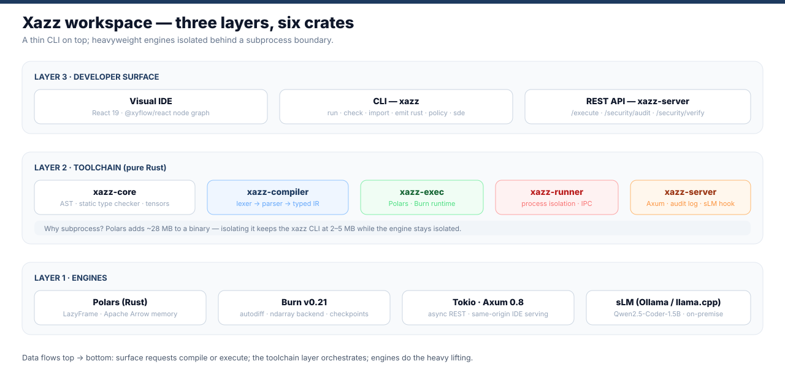
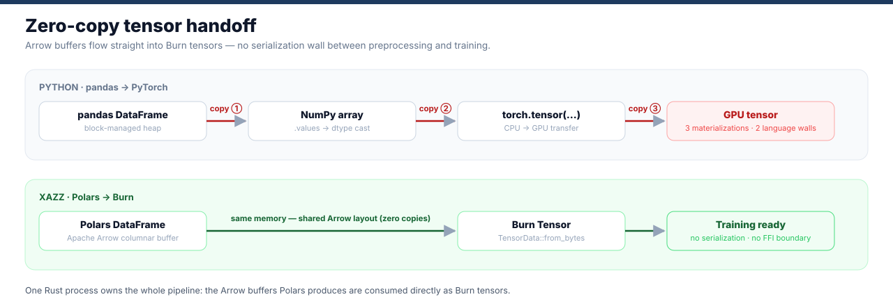
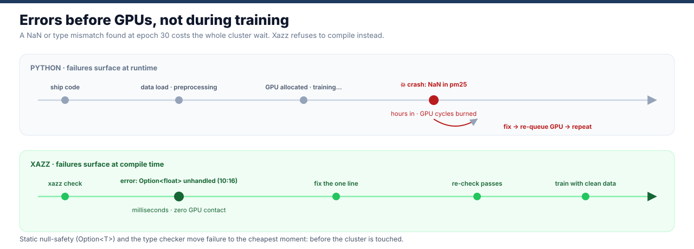

<div align="center">

```text
 ██╗  ██╗ █████╗ ███████╗███████╗
 ╚██╗██╔╝██╔══██╗╚══███╔╝╚══███╔╝
  ╚███╔╝ ███████║  ███╔╝   ███╔╝ 
  ██╔██╗ ██╔══██║ ███╔╝   ███╔╝  
 ██╔╝ ██╗██║  ██║███████╗███████╗
 ╚═╝  ╚═╝╚═╝  ╚═╝╚══════╝╚══════╝
```

# Xazz

**A Rust-based AI pipeline DSL that unifies Polars preprocessing, Burn deep-learning compilation, and static security guardrails in one script.**

*Scripting on the surface. Compiled at its core.*

[](LICENSE)
[]()
[]()
[]()
[](https://github.com/x1zzdev/Xazz/releases)
[](https://github.com/x1zzdev/Xazz/actions/workflows/ci.yml)

[한국어 README](README_kr.md)


**↑ The Visual IDE running a real pipeline end-to-end: node canvas, generated `.xzz`, training metrics, and a SHA-256 run receipt.**

</div>

---

## Why Xazz?

Python owns AI prototyping — but at pipeline scale three structural costs keep showing up:

| The Python problem | What it costs you | Xazz's answer |
| :--- | :--- | :--- |
| Type errors and NaN crash **at runtime** — often mid-training | Wasted GPU cycles, re-queued clusters, 2 a.m. debugging | **Compile-time null & type safety** (`Option<T>`) — errors surface as `line:col` diagnostics before execution |
| Data crosses **language walls** (pandas → NumPy → PyTorch) | Repeated memory copies at every boundary | **Direct-buffer tensors** — one Rust process reads Arrow buffers directly, with the remaining copies (f64→f32, columnar→row-major, host→device) made explicit in the memory model |
| No security or privacy layer anywhere in the pipeline | PII leaks, no audit trail, no regulatory story | **Policy-as-Code guardrails, differential privacy, SHA-256 audit log** — built into the language runtime |

Xazz is not a wrapper around existing libraries. The parser, AST, static type checker, typed IR, lowering, and DL compilation engine are all designed and implemented from scratch in Rust — so a single `.xzz` script controls the whole path from CSV to trained model. `.xzz` compiles to a **typed IR** once, and the runtime consumes that IR once (instead of re-parsing the source and interpreting the raw AST directly against Polars/Burn).

<div align="center">

</div>

---

## Quick Start

### Option A — Pre-built release (recommended)

1. Download the archive for your platform from [Releases](https://github.com/x1zzdev/Xazz/releases):

   | Platform | Archive |
   |----------|---------|
   | Windows x64 | `xazz-<version>-windows-x64.zip` |
   | Linux x64 | `xazz-<version>-linux-x64.tar.gz` |
   | macOS arm64 | `xazz-<version>-macos-arm64.tar.gz` |

2. Extract it and add the directory to your `PATH`.

   > **Important:** keep `xazz` and `xazz-runner` together — `xazz run` spawns `xazz-runner` as a process-isolated subprocess (with an execution timeout; this is isolation, not an OS sandbox).

3. Verify:

   ```bash
   xazz --help
   ```

   CLI output is English by default; set `XAZZ_LANG=ko` for Korean diagnostics.

### Option B — Build from source

Requires Rust stable.

```bash
git clone https://github.com/x1zzdev/Xazz.git
cd Xazz
cargo build --release -p xazz -p xazz-runner
# both binaries land in target/release/
```

### Your first pipeline (60 seconds)

```bash
xazz new my-project    # scaffold a project + sample CSV
cd my-project
xazz import data.csv   # auto-infer the schema → writes a type block into main.xzz
xazz run main.xzz      # compile + execute
```

That's the whole loop. `xazz import` reads your CSV (EUC-KR/CP949 auto-detected), infers column types, and generates the schema declaration for you.

---

## The Language in 30 Lines

**Scenario:** load air-quality CSV, clean it with null-safe Polars preprocessing, train a deep-learning model with direct-buffer tensor conversion.

### Python (pandas + PyTorch)

```python
import pandas as pd
import torch
import torch.nn as nn

# 1. Preprocessing (no static checks — NaN risk lives until runtime)
df = pd.read_csv("air_data.csv")
df["pm10"] = df["pm10"].fillna(df["pm10"].mean())
X = torch.tensor(df[["temp", "humidity"]].values, dtype=torch.float32)
y = torch.tensor(df[["pm10"]].values, dtype=torch.float32)

# 2. PyTorch model & training (memory copies + verbose boilerplate)
class Predictor(nn.Module):
    def __init__(self):
        super().__init__()
        self.net = nn.Sequential(nn.Linear(2, 64), nn.ReLU(), nn.Linear(64, 1))
    def forward(self, x): return self.net(x)

model = Predictor()
optimizer = torch.optim.Adam(model.parameters(), lr=0.01)
criterion = nn.MSELoss()
# ... (manual training loop required)
```

### Xazz (.xzz)

```xzz
// 1. Schema declaration (compile-time null safety)
type AirData = {
    station:  string,
    temp:     float,
    humidity: float,
    pm10:     Option<float>,
}

// 2. Ultra-fast lazy preprocessing via Polars
v dataset = load("air_data.csv") :: AirData
    |> fillNull("pm10", strategy: "mean")
    |> select(["station", "temp", "humidity", "pm10"])

// 3. Declarative Burn deep-learning model
model AirPredictor {
    Dense(64) -> ReLU() -> Dense(1)
}

// 4. One integrated pipeline: train → predict → visualize
v trained = dataset
    |> train(AirPredictor, target: "pm10", epochs: 10)

v prediction = dataset
    |> predict(trained, as: "pm10_pred")
    |> chart {
        type:  line,
        x:     station,
        y:     pm10_pred,
        title: "PM10 Prediction",
    }
```

| | Python (pandas + PyTorch) | Xazz (.xzz) |
|---|---|---|
| Pipeline scope | Fragmented — pandas and PyTorch glued by hand | Unified end-to-end DSL (preprocessing → DL) |
| Tensor conversion | Memory copy overhead at every boundary | Direct Arrow buffer handoff — remaining copies explicitly modeled |
| Type & null safety | Runtime exceptions (NaN / TypeError) | Compile-time static guard (`Option<T>`) |
| Model boilerplate | Manual tensor layout & dimension wiring | Auto-inferred feature dims & loss function |

---

## It Runs — Really

Every image below is captured from this repository: the binaries in `target/release`, the demos in `demo/`, the IDE in `visual-ide/`, against the bundled Seoul air-quality sample.

**Static analysis catches the typo before execution** — with a did-you-mean suggestion and `line:col` diagnostics:


**Polars preprocessing + HTML chart rendering** (`demo/preprocess_chart.xzz`):


**Burn deep-learning training** (`demo/deep_learning.xzz`) — model declaration compiled to Burn layers, real epoch losses, checkpoint written:


**Differential privacy noise injection** (`demo/dp.xzz`) — Laplace mechanism with an explicit epsilon budget:


**The Visual IDE** — full run receipt with SHA-256 code hash, real training loss and DP budget monitoring:

<div align="center">

</div>

---

## Architecture

Xazz is a modularized Rust workspace. The CLI stays a 2–5 MB binary; heavyweight engines live behind the `xazz-runner` subprocess boundary.

<div align="center">

</div>

| Crate | Role |
| :--- | :--- |
| **`xazz`** | CLI entry point (`run`, `check`, `import`, `emit`, `policy`, `sde`, `new`) |
| **`xazz-core`** | AST, tokens, errors, **Typed IR** (ir), shared types |
| **`xazz-compiler`** | Lexer → Parser → AST → **static analysis → Typed IR** → optimizer → emit |
| **`xazz-exec`** | Runtime that consumes the Typed IR: `lower` (DataOp→Polars), `dl` (Burn), `dp`, `chart` |
| **`xazz-runner`** | Process-isolated subprocess bridge (IPC) with execution timeout |
| **`xazz-server`** | Axum REST API, SHA-256 audit log, sLM correction hook, IDE serving |

Deep details live in [docs/ARCHITECTURE.md](docs/ARCHITECTURE.md) and [docs/WORKSPACE.md](docs/WORKSPACE.md).

---

## Performance

Same 4-stage pipeline (drop nulls → dual filter → group-by aggregates → fill + count), executed by pandas 3.0.5 and Xazz on real Seoul air-quality data (8 source files, 2008–2026). Median of 3 runs after warmup, wall-clock timing.

<div align="center">

</div>

- **Up to 2.62× faster** than an equivalent pandas pipeline at 228K rows (277 ms vs 726 ms); **1.93× at 4.09M rows** (2,324 ms vs 4,489 ms). The gap narrows as the data grows.
- Both sides are measured as **pipeline execution only** — the Python interpreter boot (~0.3–0.7 s) is excluded from pandas, and Xazz reports its own `[xazz:timing]` pipeline marker, so the comparison is apples-to-apples. Peak RSS uses the process tree for both engines.
- Source comes from Apache Arrow columnar memory + Polars LazyFrame query optimization + multithreaded native execution.
- Honest footnote: Polars' multithreading trades higher peak RSS for latency — pandas holds more rows per thread, Polars parallelizes across them. Note the benchmark data itself is not committed (it is built from the Seoul air-quality sources). Reproduce it yourself:

```bash
git lfs pull                                    # fetch examples/data (Git LFS)
python benches/make_scale_data.py               # build scale datasets from examples/data
python benches/run_readme_benchmark.py          # pandas vs xazz, median of 3
python benches/render_benchmark_chart.py        # regenerate the chart above
```

### Where the speed comes from

<div align="center">

</div>

<div align="center">

</div>

---

## Security & Privacy

**Policy-as-Code guardrails** scan the pipeline *before* execution — PII patterns (RRN, phone, card numbers with Luhn validation), secrets, and custom rules. Violations are blocked with structured JSON reports; an optional local sLM hook (Ollama, e.g. Qwen2.5-Coder) proposes safe corrections that are re-verified by the same policy engine before adoption — your code stays on the machine by default. See [docs/SECURITY_GUARDRAIL.md](docs/SECURITY_GUARDRAIL.md).

**Differential privacy** — Laplace/Gaussian mechanisms with ε **and δ** composition accounting. Each query records `(εᵢ, δᵢ)`; `PrivacyBudget` accumulates `Σεᵢ`, `Σδᵢ` and refuses queries that would exceed either budget. Budget state is visible in the IDE monitor. See [docs/design/dp-spec.md](docs/design/dp-spec.md).

**SHA-256 append-only audit log** — every operation is hashed and chained; tampering is verifiable via the `xazz-server` API (`/security/audit`, `/security/verify`).

| Layer | Mechanism | Status |
|---|---|---|
| Static guardrails | PII/secret detection, execution blocking, `--fix` proposals | Stable |
| Differential privacy | Laplace / Gaussian, per-session ε·δ composition accounting, IDE monitor | Stable |
| Audit infrastructure | SHA-256 hash chain, append-only, API verification | Stable |
| sLM auto-fix | Local Ollama model hook (Qwen2.5-Coder), deterministic fallback | Preview |

---

## Features

| Feature | Description | Status |
|---------|-------------|--------|
| `xazz run` | Compile and execute `.xzz` pipelines (`--json` for machine-readable results) | Stable |
| `xazz check` | Static semantic analysis — undeclared variables/columns, duplicate declarations, invalid casts, with did-you-mean hints and `line:col` spans | Stable |
| `xazz import` | Auto-infer CSV schema → generate type block (EUC-KR/CP949 auto-detected) | Stable |
| `xazz new` | Scaffold project with sample CSV and runnable example | Stable |
| `xazz emit rust` | Transpile `.xzz` → Rust source (Polars LazyFrame + Burn) | Stable |
| `xazz policy` | Policy-as-Code guardrail — block PII/secret leaks pre-execution | Stable |
| `model {}` + `train()` | Burn DL model declaration & training (Adam + MSE, checkpoints) | Stable |
| `withDp(epsilon:)` | Differential-privacy noise (laplace / gaussian) with budget tracking | Stable |
| Built-in `chart {}` | Render results as bar / line / pie / scatter (HTML) | Stable |
| `Option<T>` type system | Null-safe column declarations — `fillNull` on a non-nullable column is a compile error | Stable |
| 25 pipeline operators | `filter`, `groupBy`, `join`, `withColumn`, `cast`, `sample`, `median`, `std`, … | Stable |
| Visual IDE | Node-based pipeline editor + monitor, served by `xazz-server` | Stable |
| `xazz sde` | Synthetic data generation engine | Stable |

---

## Roadmap

| Phase | Goal | Status |
|-------|------|--------|
| Phase 1 — Core Language | DSL syntax, type system, compiler pipeline | ✅ Complete |
| Phase 2 — Execution Layer | Polars integration, CLI tooling, chart output | ✅ Complete |
| Phase 3 — IDE Integration | Visual IDE, graphical pipeline editor | ✅ Complete |
| Phase 4 — Typed IR & Optimizer | Single typed intermediate representation, double-parse removal, IR optimizer (`--opt`) | ✅ Complete (v0.3.0) |
| Phase 5 — Expanded Language | More operators, join improvements, schema evolution | 🚧 In progress |
| Phase 6 — AI Expansion | GPU backends (burn-tch / burn-wgpu), distributed training, NQP | 🔭 Planned |

**Scale roadmap:** the full plan to grow data volume, program size, team/org reach, and ML depth — with per-item GitHub issues and an execution order — lives in [docs/ROADMAP.md](docs/ROADMAP.md).

---

## Contributing

Xazz is an open-source project — bug reports, ideas, and discussions via GitHub Issues are always welcome, and code contributions via Pull Requests are open to everyone.

See [CONTRIBUTING.md](CONTRIBUTING.md) for local build instructions and contribution guidelines.

---

## License

Apache-2.0 — see [LICENSE](LICENSE).  
Commercial entitlement (product keys) is a *contract marker*, enforced legally — see [docs/design/licensing.md](docs/design/licensing.md).

---

<div align="center">

**Xazz — 2026**

</div>
