<div align="center">

```text
 ██╗  ██╗ █████╗ ███████╗███████╗
 ╚██╗██╔╝██╔══██╗╚══███╔╝╚══███╔╝
  ╚███╔╝ ███████║  ███╔╝   ███╔╝ 
  ██╔██╗ ██╔══██║ ███╔╝   ███╔╝  
 ██╔╝ ██╗██║  ██║███████╗███████╗
 ╚═╝  ╚═╝╚═╝  ╚═╝╚══════╝╚══════╝
```

# Xazz

**Polars 전처리, Burn 딥러닝 컴파일, 정적 보안 가드레일을 하나의 스크립트로 통합한 Rust 기반 AI 파이프라인 DSL.**

*겉으로는 스크립트, 핵심은 컴파일러*

[](LICENSE)
[]()
[]()
[]()
[](https://github.com/xazzdev/Xazz/releases)
[](https://github.com/xazzdev/Xazz/actions/workflows/ci.yml)

[English README](README.md)

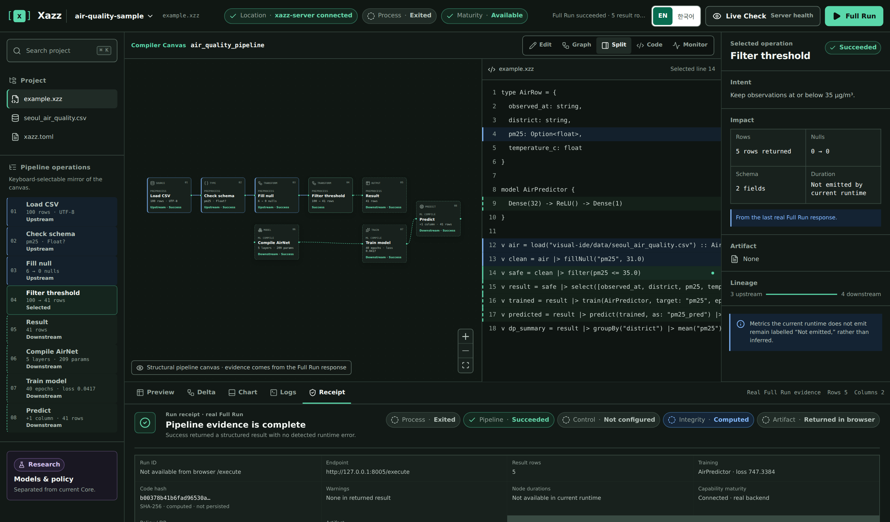

**↑ Visual IDE가 파이프라인을 엔드투엔드로 실행한 실제 화면: 노드 캔버스, 생성된 `.xzz`, 학습 지표, SHA-256 실행 영수증.**

</div>

---

## 왜 Xazz인가?

파이썬은 AI 프로토타이핑의 표준입니다 — 하지만 파이프라인 규모가 커지면 세 가지 구조적 비용이 반복적으로 나타납니다.

| 파이썬의 문제 | 대가 | Xazz의 해답 |
| :--- | :--- | :--- |
| 타입 오류와 NaN이 **런타임에** 크래시 — 흔히 학습 도중에 | 낭비된 GPU 사이클, 재배정되는 클러스터, 새벽 디버깅 | **컴파일 타임 널·타입 안전성** (`Option<T>`) — 실행 전에 행:열 단위 진단으로 오류 표면화 |
| 데이터가 **언어 경계**를 넘을 때마다 (pandas → NumPy → PyTorch) | 경계마다 반복되는 메모리 복사 | **직접 버퍼 텐서** — 하나의 Rust 프로세스가 Arrow 버퍼를 직접 읽고, 남는 복사(f64→f32, columnar→row-major, host→device)는 메모리 모델로 명시 |
| 파이프라인 어디에도 보안·프라이버시 계층이 없음 | 개인정보 유출, 감사 증적 부재, 규제 대응 불가 | **Policy-as-Code 가드레일, 차등 프라이버시, SHA-256 감사 로그** — 언어 런타임에 내장 |

Xazz는 기존 라이브러리의 래퍼가 아닙니다. 파서, AST, 정적 타입 검사기, **Typed IR**, lowering, 딥러닝 컴파일 엔진을 모두 Rust로 직접 설계·구현했기 때문에, 단일 `.xzz` 스크립트만으로 CSV에서 학습된 모델까지 전 경로를 제어합니다. `.xzz`는 **Typed IR을 한 번** 컴파일하고, 런타임은 그 IR을 **한 번** 소비합니다 (소스를 다시 파싱해 raw AST를 Polars/Burn에 직접 해석하던 이중 해석 제거).

<div align="center">
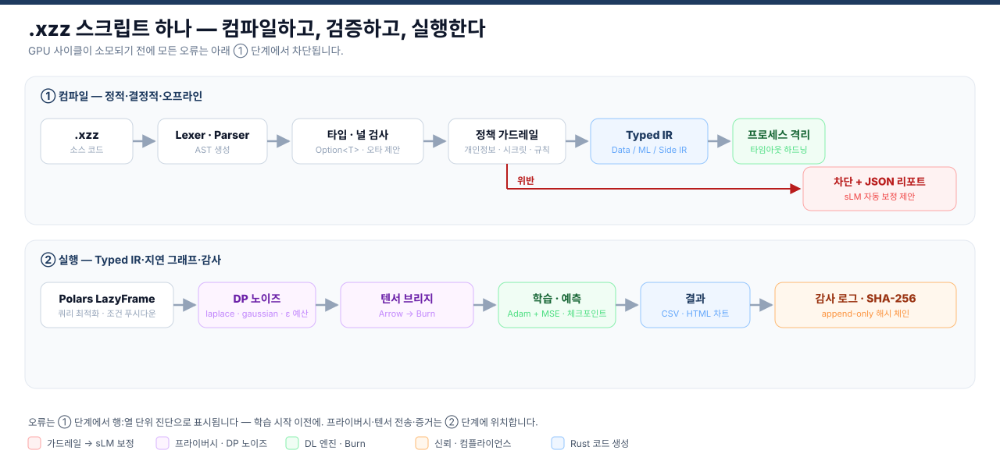
</div>

---

## 빠른 시작

### Option A — 사전 빌드 릴리스 (권장)

1. [Releases](https://github.com/xazzdev/Xazz/releases)에서 플랫폼에 맞는 아카이브를 다운로드합니다:

   | 플랫폼 | 아카이브 |
   |--------|---------|
   | Windows x64 | `xazz-<version>-windows-x64.zip` |
   | Linux x64 | `xazz-<version>-linux-x64.tar.gz` |
   | macOS arm64 | `xazz-<version>-macos-arm64.tar.gz` |

2. 압축을 풀고 디렉토리를 `PATH`에 추가합니다.

   > **주의:** `xazz`와 `xazz-runner`는 반드시 같은 디렉토리에 있어야 합니다 — `xazz run`은 `xazz-runner`를 프로세스 격리 서브프로세스로 스폰합니다 (실행 타임아웃 포함. 이는 격리이지 OS 샌드박스가 아닙니다).

3. 확인:

   ```bash
   xazz --help
   ```

### Option B — 소스에서 빌드

Rust stable 툴체인이 필요합니다.

```bash
git clone https://github.com/xazzdev/Xazz.git
cd Xazz
cargo build --release -p xazz -p xazz-runner
# 두 바이너리 모두 target/release/에 생성됩니다
```

### 첫 파이프라인 (60초)

```bash
xazz new my-project    # 프로젝트 + 샘플 CSV 생성
cd my-project
xazz import data.csv   # 스키마 자동 추론 → main.xzz에 타입 블록 기록
xazz run main.xzz      # 컴파일 + 실행
```

이게 전부입니다. `xazz import`는 CSV(EUC-KR/CP949 자동 감지)를 읽고, 컬럼 타입을 추론해 스키마 선언을 생성합니다.

---

## 30줄로 보는 언어

**시나리오:** 공기질 CSV를 로드하고, 널 안전한 Polars 전처리로 정리한 뒤, 직접 버퍼 텐서 변환으로 딥러닝 모델을 학습합니다.

### Python (pandas + PyTorch)

```python
import pandas as pd
import torch
import torch.nn as nn

# 1. 전처리 (정적 검사 없음 — NaN 위험은 런타임까지 살아있음)
df = pd.read_csv("air_data.csv")
df["pm10"] = df["pm10"].fillna(df["pm10"].mean())
X = torch.tensor(df[["temp", "humidity"]].values, dtype=torch.float32)
y = torch.tensor(df[["pm10"]].values, dtype=torch.float32)

# 2. PyTorch 모델 & 학습 (메모리 복사 + 장황한 보일러플레이트)
class Predictor(nn.Module):
    def __init__(self):
        super().__init__()
        self.net = nn.Sequential(nn.Linear(2, 64), nn.ReLU(), nn.Linear(64, 1))
    def forward(self, x): return self.net(x)

model = Predictor()
optimizer = torch.optim.Adam(model.parameters(), lr=0.01)
criterion = nn.MSELoss()
# ... (수동 학습 루프 필요)
```

### Xazz (.xzz)

```xzz
// 1. 스키마 선언 (컴파일 타임 널 안전성)
type AirData = {
    station:  string,
    temp:     float,
    humidity: float,
    pm10:     Option<float>,
}

// 2. Polars 기반 초고속 Lazy 전처리
v dataset = load("air_data.csv") :: AirData
    |> fillNull("pm10", strategy: "mean")
    |> select(["station", "temp", "humidity", "pm10"])

// 3. 선언적 Burn 딥러닝 모델
model AirPredictor {
    Dense(64) -> ReLU() -> Dense(1)
}

// 4. 하나로 통합된 파이프라인: 학습 → 예측 → 시각화
v trained = dataset
    |> train(AirPredictor, target: "pm10", epochs: 10)

v prediction = dataset
    |> predict(trained, as: "pm10_pred")
    |> chart {
        type:  line,
        x:     station,
        y:     pm10_pred,
        title: "PM10 예측",
    }
```

| | Python (pandas + PyTorch) | Xazz (.xzz) |
|---|---|---|
| 파이프라인 범위 | 분리됨 — pandas와 PyTorch를 수작업으로 연결 | 통합 엔드투엔드 DSL (전처리 → 딥러닝) |
| 텐서 변환 | 경계마다 메모리 복사 오버헤드 | 직접 Arrow 버퍼 전달 — 남는 복사는 메모리 모델로 명시 |
| 타입 & 널 안전 | 런타임 예외 (NaN / TypeError) | 컴파일 타임 정적 가드 (`Option<T>`) |
| 모델 보일러플레이트 | 수동 텐서 레이아웃 & 차원 배선 | 특성 차원 & 손실 함수 자동 추론 |

---

## 실제로 실행됩니다

아래 이미지는 모두 이 저장소에서 캡처했습니다: `target/release`의 바이너리, `demo/`의 데모, `visual-ide/`의 IDE, 동봉된 서울시 공기질 샘플 데이터.

**정적 분석이 실행 전에 오타를 잡아냅니다** — did-you-mean 제안과 행:열 진단과 함께:

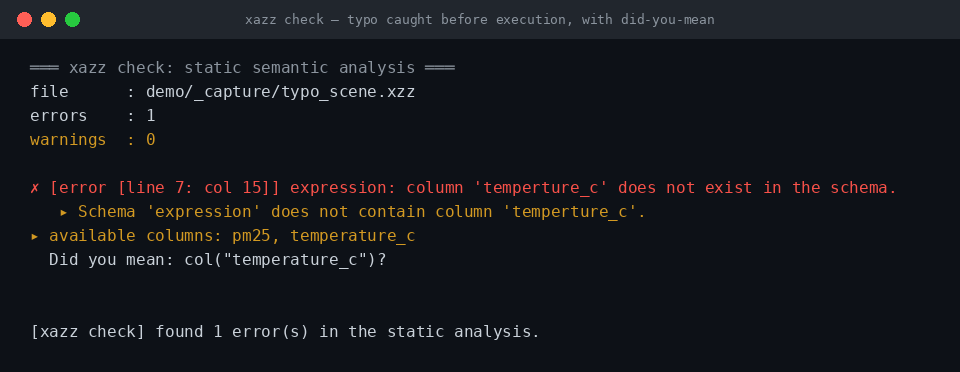

**Polars 전처리 + HTML 차트 렌더링** (`demo/preprocess_chart.xzz`):

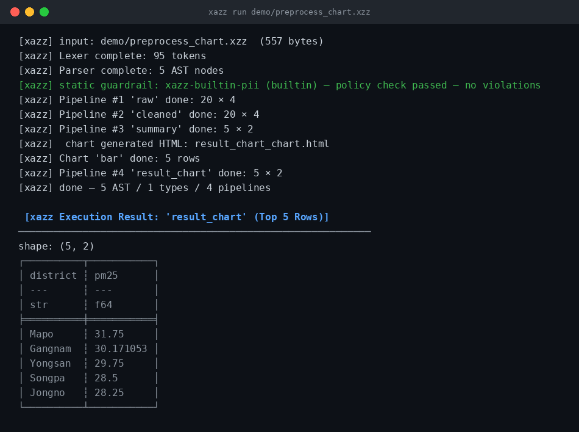

**Burn 딥러닝 학습** (`demo/deep_learning.xzz`) — 모델 선언이 Burn 레이어로 컴파일되고, 실제 에포크 손실이 기록되며, 체크포인트가 저장됩니다:

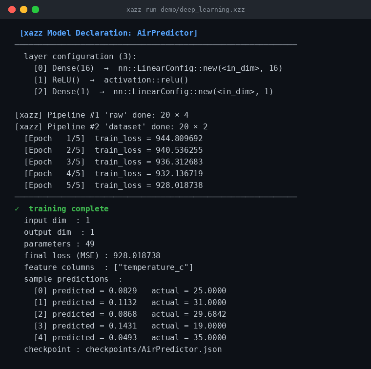

**차등 프라이버시 노이즈 주입** (`demo/dp.xzz`) — 명시적 엡실론 예산과 함께 라플라스 메커니즘이 적용됩니다:

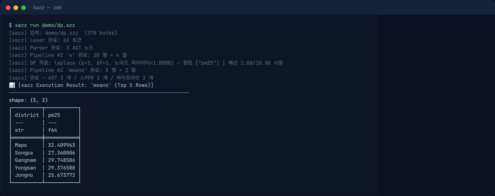

**Visual IDE** — SHA-256 코드 해시가 찍힌 실행 영수증, 실제 학습 손실, DP 예산 모니터링:

<div align="center">
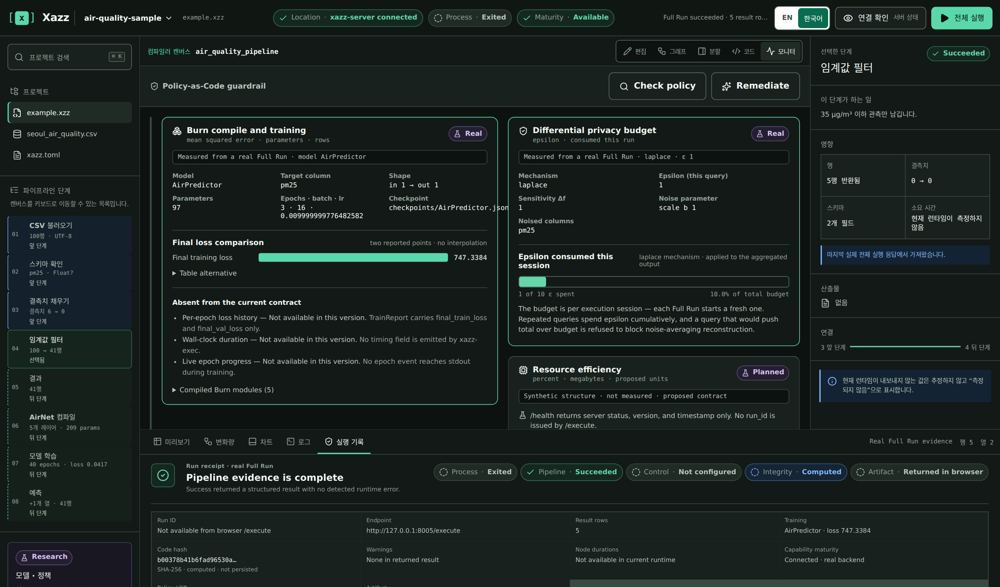
</div>

---

## 아키텍처

Xazz는 모듈화된 Rust 워크스페이스입니다. CLI는 2–5 MB 경량 바이너리를 유지하고, 무거운 엔진은 `xazz-runner` 서브프로세스 경계 뒤에 격리됩니다.

<div align="center">
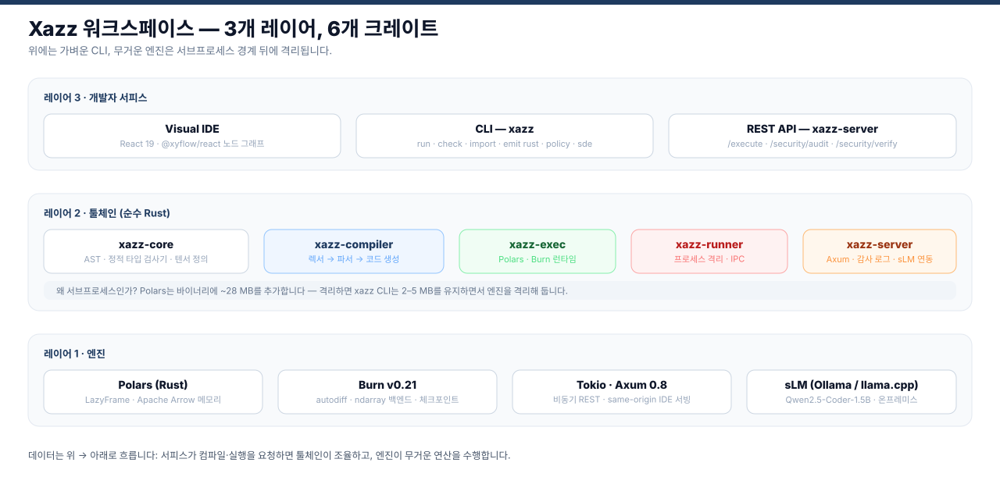
</div>

| 크레이트 | 역할 |
| :--- | :--- |
| **`xazz`** | CLI 진입점 (`run`, `check`, `import`, `emit`, `policy`, `sde`, `new`) |
| **`xazz-core`** | AST, 토큰, 에러, **Typed IR** (`ir`), 공통 타입 |
| **`xazz-compiler`** | 렉서 → 파서 → AST → **정적 분석 → Typed IR** → 최적화 → emit |
| **`xazz-exec`** | Typed IR 소비 런타임: `lower`(DataOp→Polars), `dl`(Burn), `dp`, `chart` |
| **`xazz-runner`** | 프로세스 격리 서브프로세스 브리지 (IPC) + 실행 타임아웃 |
| **`xazz-server`** | Axum REST API, SHA-256 감사 로그, sLM 보정 연동, IDE 서빙 |

심층 내용은 [docs/ARCHITECTURE.md](docs/ARCHITECTURE.md)와 [docs/WORKSPACE.md](docs/WORKSPACE.md)에 정리되어 있습니다.

---

## 성능

동일한 4단계 파이프라인(널 제거 → 이중 필터 → 그룹 집계 → fill + count)을 실제 서울시 공기질 데이터(2008–2026, 원본 8개 파일)에 대해 pandas 3.0.5와 Xazz로 실행했습니다. 워밍업 1회 후 3회 측정의 중앙값, wall-clock 기준입니다.

<div align="center">
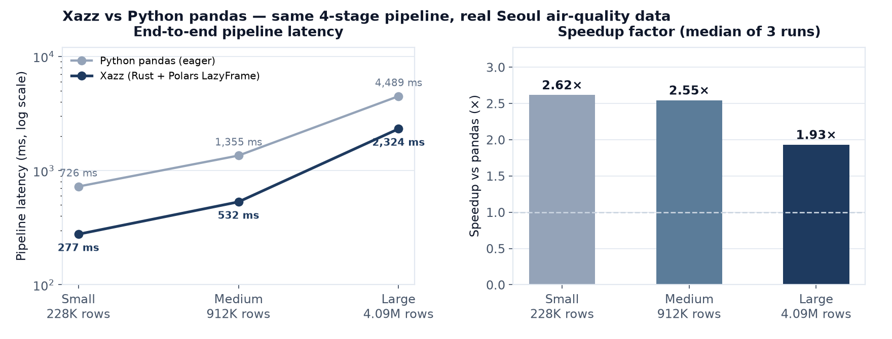
</div>

- 동등한 pandas 파이프라인 대비 **최대 2.62배 빠름** (228K 행: 277 ms vs 726 ms), **409만 행에서는 1.93배** (2,324 ms vs 4,489 ms). 데이터가 커질수록 격차가 줄어듭니다. 소규모 수치에는 pandas 인터프리터 부팅 비용이 포함되어 있으므로, 견고한 기준치는 409만 행의 1.93배로 보세요.
- 성능의 원천은 Apache Arrow 컬럼형 메모리 + Polars LazyFrame 쿼리 최적화 + 멀티스레드 네이티브 실행입니다.
- 정직한 주석: Polars의 멀티스레딩은 지연 시간을 줄이는 대신 더 높은 피크 RSS를 치른다는 트레이드오프가 있습니다. 벤치마크 데이터 자체는 커밋되어 있지 않습니다(서울시 공기질 원본에서 생성). 직접 재현해 볼 수 있습니다:

```bash
git lfs pull                                    # examples/data 가져오기 (Git LFS)
python benches/make_scale_data.py               # examples/data에서 스케일 데이터셋 생성
python benches/run_readme_benchmark.py          # pandas vs xazz, 3회 중앙값
python benches/render_benchmark_chart.py        # 위 차트 재생성
```

### 속도의 근원

<div align="center">
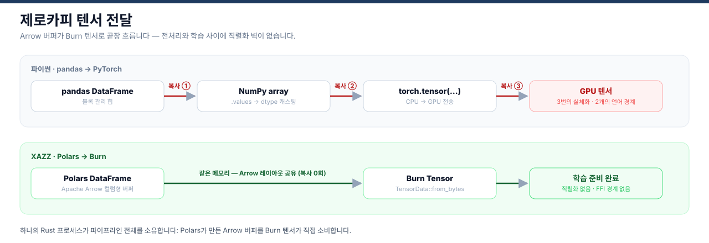
</div>

<div align="center">
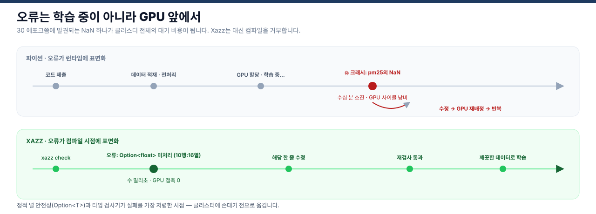
</div>

---

## 보안 & 프라이버시

**Policy-as-Code 가드레일**은 실행 *이전에* 파이프라인을 검사합니다 — 개인정보 패턴(주민번호, 전화번호, Luhn 검증 카드번호), 시크릿, 커스텀 규칙. 위반은 구조화된 JSON 리포트와 함께 차단되며, 선택적 로컬 sLM 훅(Ollama, 예: Qwen2.5-Coder)이 안전한 코드 수정을 제안합니다 — 제안은 채택 전에 동일한 정책 엔진으로 재검증되며, 기본 구성에서 코드는 기기를 떠나지 않습니다. 자세한 내용은 [docs/SECURITY_GUARDRAIL.md](docs/SECURITY_GUARDRAIL.md).

**차등 프라이버시** — 라플라스/가우시안 메커니즘, 세션별 ε **및 δ** 조성 회계(composition accounting). 각 쿼리는 `(εᵢ, δᵢ)`를 기록하고 `PrivacyBudget`이 `Σεᵢ`·`Σδᵢ` 를 누적하며, 어느 쪽 예산을 초과할 쿼리는 거부됩니다. 예산 소모는 IDE 모니터에서 확인할 수 있습니다. 상세: [docs/design/dp-spec.md](docs/design/dp-spec.md).

**SHA-256 append-only 감사 로그** — 모든 연산이 해시되어 체인으로 연결됩니다. `xazz-server` API(`/security/audit`, `/security/verify`)로 변조 여부를 검증할 수 있습니다.

| 계층 | 메커니즘 | 상태 |
|---|---|---|
| 정적 가드레일 | 개인정보/시크릿 탐지, 실행 차단, `--fix` 제안 | Stable |
| 차등 프라이버시 | 라플라스 / 가우시안, 세션별 ε·δ 조성 회계, IDE 모니터 | Stable |
| 감사 인프라 | SHA-256 해시 체인, append-only, API 검증 | Stable |
| sLM 자동 보정 | 로컬 Ollama 모델 훅 (Qwen2.5-Coder), 결정적 폴백 | Preview |

---

## 기능

| 기능 | 설명 | 상태 |
|---------|-------------|--------|
| `xazz run` | `.xzz` 파이프라인 컴파일·실행 (`--json` 기계 판독 결과) | Stable |
| `xazz check` | 정적 의미 분석 — 미선언 변수/컬럼, 중복 선언, 잘못된 cast, did-you-mean 제안, 행:열 단위 진단 | Stable |
| `xazz import` | CSV 스키마 자동 추론 → 타입 블록 생성 (EUC-KR/CP949 자동 감지) | Stable |
| `xazz new` | 샘플 CSV + 실행 가능한 예제가 포함된 프로젝트 생성 | Stable |
| `xazz emit rust` | `.xzz` → Rust 소스 변환 (Polars LazyFrame + Burn) | Stable |
| `xazz policy` | Policy-as-Code 가드레일 — 실행 전 개인정보·시크릿 유출 차단 | Stable |
| `model {}` + `train()` | Burn 딥러닝 모델 선언·학습 (Adam + MSE, 체크포인트) | Stable |
| `withDp(epsilon:)` | 차등 프라이버시 노이즈 (laplace / gaussian) + 예산 추적 | Stable |
| 내장 `chart {}` | 결과를 bar / line / pie / scatter로 렌더링 (HTML) | Stable |
| `Option<T>` 타입 시스템 | 널 안전 컬럼 선언, `fillNull(strategy:)` | Stable |
| 25 파이프라인 연산자 | `filter`, `groupBy`, `join`, `withColumn`, `cast`, `sample`, `median`, `std`, … | Stable |
| Visual IDE | 노드 기반 파이프라인 편집기 + 모니터, `xazz-server`가 서빙 | Stable |
| `xazz sde` | 합성 데이터 생성 엔진 | Preview |

---

## 로드맵

| Phase | 목표 | 상태 |
|-------|------|------|
| Phase 1 — 코어 언어 | DSL 문법, 타입 시스템, 컴파일러 파이프라인 | ✅ 완료 |
| Phase 2 — 실행 계층 | Polars 연동, CLI 도구, 차트 출력 | ✅ 완료 |
| Phase 3 — IDE 통합 | Visual IDE, 그래픽 파이프라인 편집기 | ✅ 완료 |
| Phase 4 — Typed IR & 최적화 | 단일 Typed IR, 이중 해석 제거, IR 최적화(`--opt`) | ✅ 완료 (v0.3.0) |
| Phase 5 — 언어 확장 | 연산자 확장, join 개선, 스키마 진화 | 🚧 진행 중 |
| Phase 6 — AI 확장 | GPU 백엔드(burn-tch / burn-wgpu), 분산 학습, NQP | 🔭 계획 |

---

## 기여

Xazz는 오픈소스 프로젝트입니다 — 버그 제보, 아이디어, 논의는 GitHub Issues로 언제든 환영하며, 코드 기여는 Pull Request로 열려 있습니다.

로컬 빌드 방법과 기여 가이드는 [CONTRIBUTING.md](CONTRIBUTING.md)에서 확인하세요.

---

## 라이선스

Apache-2.0 — [LICENSE](LICENSE) 참고.  
상용 사용권(제품 키)은 계약의 증거 표식이며 법적으로 강제됩니다 — [docs/design/licensing.md](docs/design/licensing.md) 참고.

---

<div align="center">

**Xazz — 2026**

</div>
