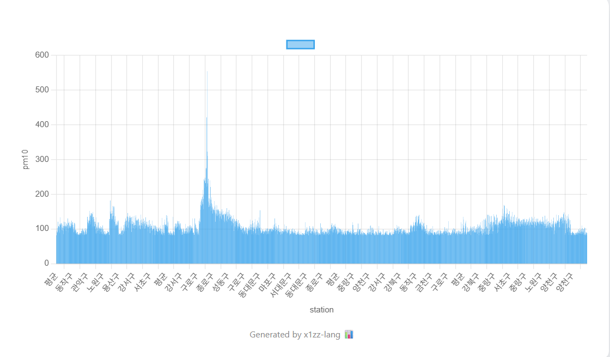
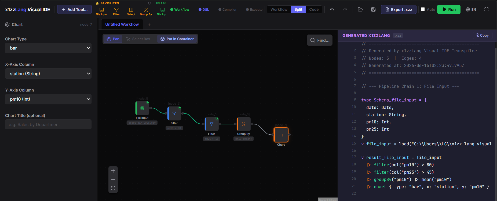
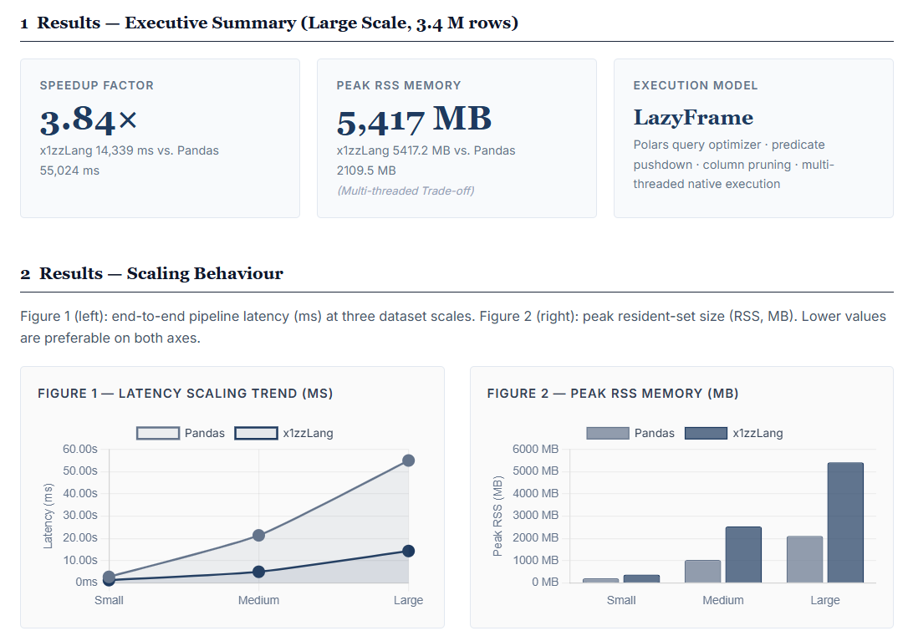

<div align="center">

```text
 ██╗  ██╗ █████╗ ███████╗███████╗
 ╚██╗██╔╝██╔══██╗╚══███╔╝╚══███╔╝
  ╚███╔╝ ███████║  ███╔╝   ███╔╝ 
  ██╔██╗ ██╔══██║ ███╔╝   ███╔╝  
 ██╔╝ ██╗██║  ██║███████╗███████╗
 ╚═╝  ╚═╝╚═╝  ╚═╝╚══════╝╚══════╝
```

# Xazz

**Polars 초고속 데이터 전처리와 Burn 딥러닝 컴파일러, 정적 보안 가드레일을 단일 DSL로 통합한 차세대 Rust 기반 AI 파이프라인 개발 플랫폼.**

*겉으로는 스크립트, 핵심은 컴파일러*

[](LICENSE)
[]()
[]()
[]()
[](https://github.com/xazzdev/Xazz/releases)
[](https://github.com/xazzdev/Xazz/actions/workflows/ci.yml)

[English README](README.md)

</div>

---

## 개요

### 개발 목적

Python 기반 AI 파이프라인의 런타임 타입 오류와 언어 간 오버헤드를 구조적으로 해결하기 위해 개발되었습니다. Rust의 강타입 시스템으로 결측치와 타입 오류를 컴파일 단계에서 원천 검증하고, 실시간 보안 무결성 검증 기능을 통합하여 단일 DSL 스크립트만으로 데이터 전처리부터 딥러닝 학습까지 엔드투엔드로 제어하는 차세대 오픈소스 AI 개발 환경을 지향합니다.

### 프로젝트 소개

Xazz는 Polars 엔진과 Burn 프레임워크를 결합한 Rust 기반 엔드투엔드 DSL 플랫폼입니다. 스크립트 언어 특유의 개발 생산성을 유지하면서도 제로카피 기반 텐서 변환과 정적 분석 기반 널(Null) 안전성을 제공합니다. 대용량 데이터 처리 과정에서 발생할 수 있는 비정상 입력과 메모리 접근 위험을 최소화하기 위해 데이터 흐름 추적 기반 샌드박스를 구현했습니다. 본 프로젝트는 단순 라이브러리 래퍼가 아닌 파서, AST, 데이터 전처리, 보안 런타임, 딥러닝 컴파일 엔진까지 핵심 툴체인을 바닥부터 직접 설계·구현한 독립 오픈소스 플랫폼입니다.

---

## 핵심 기능 및 기술 요소

### 1. Compiler Core & Acceleration
- **컴파일러 코어**: 독자적인 AI 스크립트 언어 파서(Parser) 및 추상 구문 트리(AST) 툴체인 구현
- **딥러닝 컴파일 계층**: Rust 기반 고성능 AI 프레임워크인 **Burn**을 연동하여 제로카피 텐서 연산 및 딥러닝 학습 레이어로 전환되는 컴파일 엔진 구축
- **데이터 가속 엔진**: **Polars** 엔진을 융합하여 사용자의 전처리 명령을 초고속 LazyFrame 연산 그래프로 변환 및 실행

### 2. Security & Privacy Guardrails
- **정적 가드레일 (Policy-as-Code)**: 코드 실행 직전 단계에서 개인정보 유출 및 보안 컴플라이언스 위반을 실시간 탐지·차단하는 통제 계층
- **프라이버시 R&D**: 통계적 노이즈 주입으로 수학적 안전성을 보장하는 **차등 프라이버시(Differential Privacy, DP)** 알고리즘 연구 및 검증
- **내장형 sLM 보안 어시스턴트**: 외부 유출 없는 온프레미스 sLM을 탑재하여 차단된 코드를 안전하게 자동 보정하고 위반 사유 리포트 제공

### 3. Visual Console & Monitoring
- **비주얼 콘솔 UI**: React 및 `@xyflow/react` 기반으로 데이터 전처리 및 딥러닝 컴파일 흐름을 시각화하는 노드 기반 웹 IDE 제공
- **실시간 모니터링**: 차등 프라이버시의 보안 예산(Privacy Budget) 소모 상태와 연산 자원 효율성을 모니터링하는 통계 대시보드 구축

### 4. 💎 Reliability Infrastructure
- **신뢰성 인프라**: 모든 연산 이력을 영구 보존하는 **SHA-256 기반 감사 로그(Audit Log)** 시스템 설계
- **글로벌 CI/CD**: GitHub Actions 기반 자동화 테스트 및 신뢰도 높인 검증 환경 구축

---

## 아키텍처 및 크레이트 구조

Xazz는 모듈화된 Rust 워크스페이스(Workspace)로 구성되어 있습니다.

| Crate | 역할 및 기능 설명 |
| :--- | :--- |
| **`xazz`** | CLI 바이너리 진입점 (`xazz run`, `xazz emit` 등 명령 제공) |
| **`xazz-core`** | AST(추상 구문 트리), 정적 타입 검사기, 공통 데이터 타입 및 텐서 정의 |
| **`xazz-compiler`** | `.xzz` DSL 스크립트 파싱, AST 생성, Burn/Polars 연산 컴파일러 |
| **`xazz-runner`** | 데이터 흐름 추적 기반 보안 샌드박싱 및 서브프로세스 격리 런타임 |
| **`xazz-exec`** | Polars LazyFrame 전처리 및 Burn 텐서 딥러닝 실행 엔진 |
| **`xazz-server`** | sLM 보안 보정 엔진, 웹 콘솔 백엔드 및 SHA-256 감사 로그 서버 |

---

## 기대 효과

- **극대화된 연산 효율성**: Apache Arrow 기반 메모리 레이아웃과 Rust 런타임 활용으로 기존 Python 데이터 처리 환경 대비 파이프라인 연산 및 자원 효율 향상
- **GPU 자원 낭비 원천 차단**: 컴파일 단계에서 결측치 및 타입을 정적으로 검사하여 오류를 사전 발견, 대규모 분산 학습 시 불필요한 GPU 자원 손실 예방
- **엔터프라이즈 데이터 신뢰성**: 제로-오버헤드 보안 엔진 및 차등 프라이버시를 통해 금융·의료 등 민감 데이터를 다루는 산업에서도 안심하고 AI 학습을 수행할 수 있는 보안 인프라 제공
- **생태계 저변 확대**: 선언형 데이터 파이프라인 DSL로 개발 진입 장벽을 낮추고, 체계적인 기여 가이드라인을 기반으로 대한민국 주도의 데이터 엔지니어링 오픈소스 생태계 활성화에 기여

---

## 빠른 예제

**시나리오:** 공기질 CSV 데이터를 로드하고, Polars로 널 안전 전처리를 수행한 뒤, 제로카피 텐서 변환으로 Burn 딥러닝 예측 모델을 학습한다.

### Python (pandas + PyTorch)

```python
import pandas as pd
import torch
import torch.nn as nn

# 1. 전처리 (정적 타입 검사 없음, 런타임 NaN 위험)
df = pd.read_csv("air_data.csv")
df["pm10"] = df["pm10"].fillna(df["pm10"].mean())
X = torch.tensor(df[["temp", "humidity"]].values, dtype=torch.float32)
y = torch.tensor(df[["pm10"]].values, dtype=torch.float32)

# 2. PyTorch 모델 & 학습 (메모리 복사 및 장황한 보일러플레이트)
class Predictor(nn.Module):
    def __init__(self):
        super().__init__()
        self.net = nn.Sequential(nn.Linear(2, 64), nn.ReLU(), nn.Linear(64, 1))
    def forward(self, x): return self.net(x)

model = Predictor()
optimizer = torch.optim.Adam(model.parameters(), lr=0.01)
criterion = nn.MSELoss()
# ... (장황한 학습 루프 필요)
```

### Xazz (.xzz)

```xzz
// 1. 스키마 선언 (컴파일 타임 Null 안전)
type AirData = {
    temp:     float,
    humidity: float,
    pm10:     Option<float>,
}

// 2. Polars 기반 초고속 Lazy 전처리
v dataset = load("air_data.csv") :: AirData
    |> fillNull("pm10", strategy: "mean")
    |> select(["temp", "humidity", "pm10"])

// 3. 선언적 Burn 딥러닝 모델
model AirPredictor {
    Dense(64) -> ReLU() -> Dense(1)
}

// 4. 파이프라인 통합 실행: 학습 → 예측 → 시각화
v model = dataset
    |> train(AirPredictor, target: "pm10", epochs: 10)

v prediction = dataset
    |> predict(model, as: "pm10_pred")
    |> chart {
        type:  line,
        x:     station,
        y:     pm10_pred,
        title: "PM10 예측",
    }
```

| 기능 | Python (pandas + PyTorch) | Xazz (.xzz) |
|------|--------------------------|-------------|
| 파이프라인 범위 | 분리됨 (pandas + PyTorch 별도) | 통합 End-to-End DSL (전처리→DL) |
| 텐서 변환 | 메모리 복사 오버헤드 (CPU/GPU) | 제로카피 텐서 통합 (Burn 백엔드) |
| 타입 & Null 안전 | 런타임 예외 위험 (NaN / 타입 오류) | 컴파일 타임 정적 가드 (`Option<T>`) |
| 모델 보일러플레이트 | 수동 텐서 레이아웃 & 차원 배선 | 자동 추론 특성 차원 & 손실 함수 |

**`xazz import`부터 실행까지:**

```bash
xazz new my-project    # 프로젝트 + 샘플 CSV 생성
cd my-project
xazz import data.csv   # 스키마 자동 추론 → main.xzz에 타입 블록 기록
xazz run main.xzz      # 컴파일 + 파이프라인 실행
```

---

## 실행 결과 미리보기

`chart {}` 블록이 포함된 파이프라인을 실행하면 HTML 차트로 결과를 렌더링한다.



> *예시: 파이프라인 실행 결과를 bar 차트로 렌더링. 차트 출력은 HTML 파일로 저장된다.*

---

## Visual IDE

[](https://github.com/xazzdev/Xazz-visual-ide)

`.xzz` 파이프라인을 위한 그래픽 편집 및 실행 환경.  
→ [Xazz Visual IDE 저장소](https://github.com/xazzdev/Xazz-visual-ide)

---

## 기능

| 기능 | 설명 | 상태 |
|------|------|------|
| `xazz run` | `.xzz` 파이프라인 컴파일 및 실행 | Stable |
| `xazz import` | CSV 스키마 자동 추론 → 타입 블록 생성 | Stable |
| `xazz new` | 샘플 CSV + 실행 가능한 예제 포함 프로젝트 생성 | Stable |
| `xazz emit rust` | `.xzz` → Rust 소스 변환 (Polars LazyFrame + Burn) | Stable |
| `model {}` + `train()` | Burn 딥러닝 모델 선언·학습 (Adam + MSE, CPU 백엔드) | Stable |
| `xazz check` | Neural Query Planner 기반 정적 분석 | Experimental |
| `xazz sde` | 합성 데이터 생성 엔진 연동 | Preview |
| 내장 `chart {}` | 파이프라인 결과를 bar / line / pie / scatter 차트로 렌더링 | Stable |
| `Option<T>` 타입 시스템 | null-safe 컬럼 선언, `fillNull` 연산자 | Stable |
| `fillNull(strategy:)` | 평균/중앙값/0 채우기 전략 (`strategy: "mean"`) | Stable |
| EUC-KR CSV 지원 | CP949 인코딩 한글 CSV 자동 감지 및 디코딩 | Stable |
| Visual IDE | 그래픽 파이프라인 편집기 (별도 저장소) | Stable |

---

## 설치

### Option A — 사전 빌드 릴리스 (권장)

1. [Releases](https://github.com/xazzdev/Xazz/releases)에서 플랫폼에 맞는 아카이브를 다운로드한다.

   | 플랫폼 | 아카이브 |
   |--------|---------|
   | Windows x64 | `xazz-<version>-windows-x64.zip` |
   | Linux x64 | `xazz-<version>-linux-x64.tar.gz` |
   | macOS arm64 | `xazz-<version>-macos-arm64.tar.gz` |

2. 아카이브를 압축 해제한다. `xazz`와 `xazz-runner`가 같은 디렉토리에 있어야 한다.

   > **주의:** 두 바이너리는 반드시 같은 디렉토리에 있어야 한다. `xazz run`은 `xazz-runner`를 서브프로세스로 스폰하기 때문에 `xazz-runner`가 없으면 파이프라인 실행이 실패한다.

3. 압축 해제한 디렉토리를 `PATH`에 추가한다.

4. 확인:

   ```bash
   xazz --help
   ```

### Option B — 소스에서 빌드

Rust stable 툴체인이 필요하다.

```bash
git clone https://github.com/xazzdev/Xazz.git
cd Xazz

# CLI 빌드
cargo build --release -p xazz

# 실행 엔진 빌드
cargo build --release -p xazz-runner

# 두 바이너리 모두 target/release/에 생성됨
```

실행 전에 `xazz`와 `xazz-runner`를 같은 디렉토리에 배치한다.

---

## 벤치마크



서울 공기질 데이터셋 340만 행을 기준으로 Xazz와 동일한 pandas 파이프라인을 비교했다.

> 해당 워크로드에서 pandas 대비 최대 **3.84배 빠른** 실행 속도를 달성했다.

이 성능은 주로 Polars LazyFrame 백엔드 덕분이다. Polars는 실행 전에 쿼리 최적화를 적용한다. 벤치마크는 컴파일러 오버헤드가 아닌 엔드-투-엔드 파이프라인 처리량을 측정한다.

벤치마크 소스: [`benches/run_benchmark.py`](benches/run_benchmark.py) / [`benches/benchmark_pipeline.xzz`](benches/benchmark_pipeline.xzz)

---

## 로드맵

| Phase | 목표 | 상태 |
|-------|------|------|
| Phase 1 — Core Language | DSL 문법, 타입 시스템, 컴파일러 파이프라인 | 완료 |
| Phase 2 — Execution Layer | Polars 연동, CLI 도구, 차트 출력 | 완료 |
| Phase 3 — IDE Integration | Visual IDE, 그래픽 파이프라인 편집기 | 완료 |
| Phase 4 — Expanded Language | 연산자 확장, join 개선, 스키마 진화 | 진행 중 |
| Phase 5 — AI Expansion | Burn 딥러닝 계층(모델 선언·학습·체크포인트), NQP | 딥러닝 완료 / NQP Experimental |

---

## 기여

버그 제보, 아이디어, 논의는 GitHub Issues로, 코드 기여는 Pull Request로 언제든 환영해요. 여러분의 참여를 기다리고 있습니다.

- 이슈(버그 제보, 아이디어, 논의): 항상 열려 있어요
- Pull Request: 항상 열려 있어요

로컬 빌드 방법과 기여 가이드는 [CONTRIBUTING.md](CONTRIBUTING.md)에서 확인하세요.

---

## 라이선스

Apache-2.0 — 자세한 내용은 [LICENSE](LICENSE) 참고.

---

<div align="center">

**Xazz — 2026**

</div>
